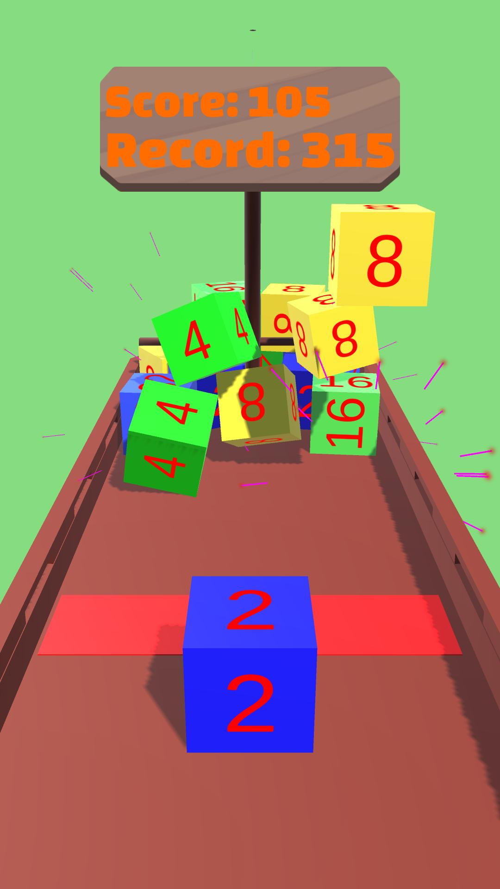
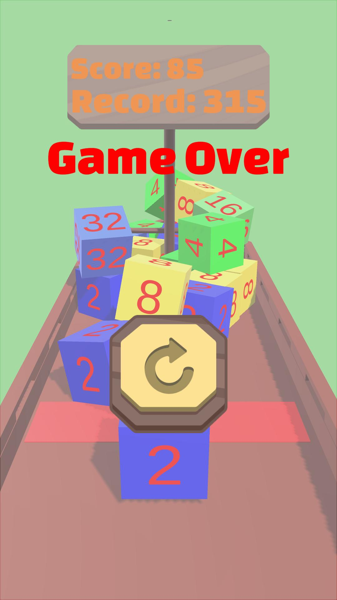

# 🎲 Cube Clash: Prototype2048

A simple and addictive WebGL game where you control numbered cubes (2 or 4) **on a ship**, combine identical cubes to get bigger numbers, and try not to let cubes cross the red line!  

---

## 🎮 Play Now
▶️ [Play the game in your browser](https://arttr0.github.io/Prototype-2048-game/)

---

## 📸 Screenshots / GIF

| Game | Game Over |
|------|-----------|
|  |  |

| Gameplay GIF |
|--------------|
|  |

---

## 📝 Game Description

In **Cube Clash: Prototype2048**, you:  

- 🎲 Control cubes numbered 2 or 4 **on a ship**  
- ➕ Combine identical cubes to double their value  
- ⚠️ Avoid letting cubes cross the red line (if they do, you lose!)  
- 🕹️ Move the cube **horizontally**:  
  - **Mobile devices:** hold and swipe your finger  
  - **PC:** hold the mouse button and drag  
- 🗺️ Progress through rounds with increasing difficulty — coming in the next update  

---

## 🕹️ Controls

- **Mobile:** hold and swipe finger horizontally  
- **PC:** hold and drag mouse horizontally  
- **Cube launch:** cube drops automatically once movement finishes  
- **Boosts / special actions:** will be added in future updates  

---

## 🎨 Features

- Mobile-friendly and desktop-ready  
- Simple but addictive cube-combining mechanic  
- Clear win and lose states with visual feedback  
- Screenshots and short GIF for demonstration  
- Easy to expand with new cube types, power-ups, and levels  

---

## 📁 How to Run Locally

1. Install **Unity 2022.3.5f1 LTS**  
2. Clone the repository:  

```bash
git clone https://github.com/Arttr0/Prototype-2048.git